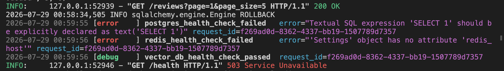
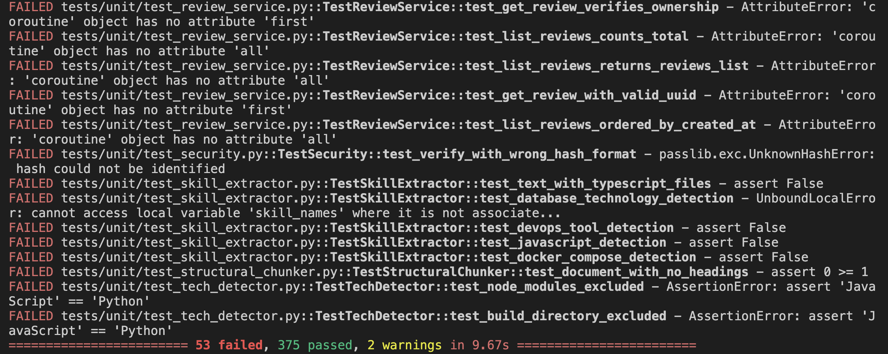
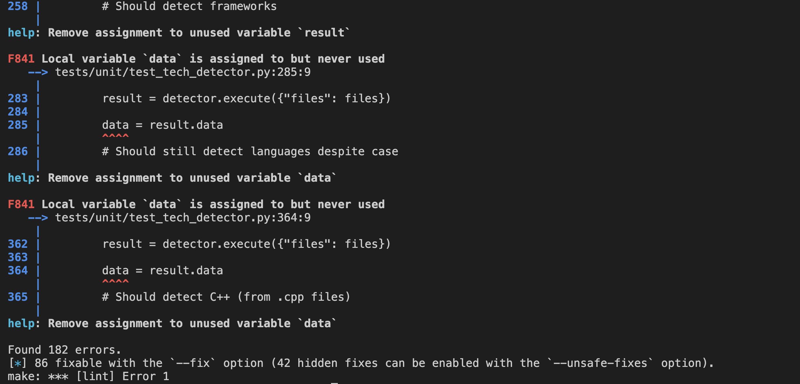

# JOURNAL.md

## Week 7 — Issue selection

**[Issue link]:** (https://github.com/ascherj/pathreview/issues/155)

**Issue title:** Health check references `settings.redis_host`, which does not exist on Settings

**Tier:** [x] Tier 1  [ ] Tier 2  [ ] Tier 3

**Problem summary:**
The `/health` endpoint's Redis check in `api/routes/health.py` builds a `redis.Redis` client using `settings.redis_host` and `settings.redis_port`, but the `Settings` model in `core/config.py` never defines those fields — it only defines a single `redis_url` field. Every call to `/health` therefore raises an `AttributeError` when it tries to read those missing attributes. Because the check is wrapped in a broad `except`, the error is swallowed silently and the endpoint just reports `"redis": "unhealthy"`, so the health check is currently a false negative on every request regardless of whether Redis is actually reachable. A correct fix would build the Redis client from the existing `redis_url` (e.g. via `redis.Redis.from_url(settings.redis_url)`) so the reported status reflects Redis's real state, and would add test coverage for this route since none currently exists.

**Scope reasoning ("Is this right for me?"):**

This issue is a good first issue for me to start with because it is concentrated to one file and not spanning multiple modules to understand it. The path of the app that is affected is clear and isolated from other api endpoints' functionality. I am able to reproduce it and envision what a fix would be ( not returning an AttributeError). I believe the time I will allocate to this issue would be around 3-6 hours.

**Branch name:** fix/155-health-check-redis-host

**Setup confirmation:** [x] App runs locally at localhost:5173

**Cohort ledger:** [x] Issue added to cohort ledger

## Week 8 — Reproduction & solution planning

**Reproduction commit link:** https://github.com/Ishimwe2000/pathreview/commit/b207ffc2f25f4b7fdf1c4cf7f8b24dcf544e9fbb

**Reproduction summary:**
[1–2 sentences: How did you reproduce the issue? What did you observe?]
I reproduced the issue by first installing the dependencies and running the app in one terminal using `make run`. I then opened another terminal and made a curl request on the backend using this command: `curl http://localhost:8000/health`. I observed this output in the curl terminal: 
`{"detail":{"status":"unhealthy","dependencies":{"postgres":"unhealthy","redis":"unhealthy","vector_db":"healthy"},"safety_events_last_hour":0,"timestamp":"2026-07-28T22:59:55.982628"}` but also observed `2026-07-29 00:59:56 [error    ] redis_health_check_failed      error="'Settings' object has no attribute 'redis_host'" request_id=f269ad0d-8362-4337-bb19-1507789d7357` reproducing the bug behavior.

**PLAN.md link:** https://github.com/Ishimwe2000/pathreview/blob/fix/155-health-check-redis-host/PLAN.md

**Walkthrough video (recommended):** [link to your Loom video, ≤2 min — recommended, not graded]

**Blockers or open questions:**
[Anything you're still uncertain about going into Week 9, or leave blank]
There were some precommit failures related to typing annotation that will need to be fixed. I did not fix them in my commits because I was not touching those same changes, but ideally for the precommit hooks should scan the project and return no issues.
## Week 9 — Solution building & PR submission

### Check-in 1 (mid-week)

**Current progress:**
Below is some baseline testing obtained from running some commands against the main branch in order to determine what currently works and what is broken on the branch before adding in my changes

make setup results from the main branch

make check results from the main branch

The above results show that there are already some failures on the main branch before I add in my changes. I plan to use these to baseline  whether my changes introduce more failures or fix some of the existing failures.

**Next steps:**
[What are you working on for the rest of the week?]

**Blockers:**
[Anything slowing you down? Or leave blank.]

---

### Check-in 2 (end of week)

**PR link:** [link to your submitted pull request]

**Branch:** [the branch name you worked on, e.g. `fix/123-short-description`]

**What you built:**
[1–3 sentences summarizing what your fix does and how it works]

**Tests added or updated:**
[Which test files did you touch? What do they cover?]

**Self-review confirmation:** [ ] make check passes  [ ] make test-unit passes

**Draft PR feedback received from:** [name or Slack handle, or "none"]